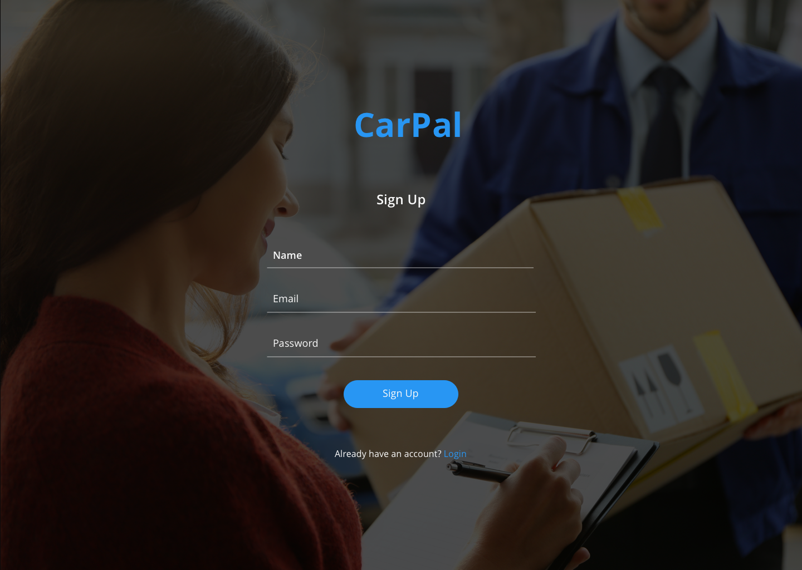
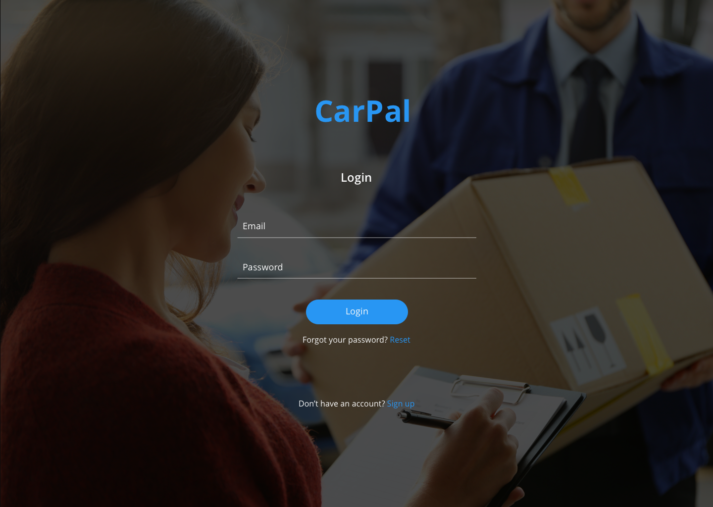
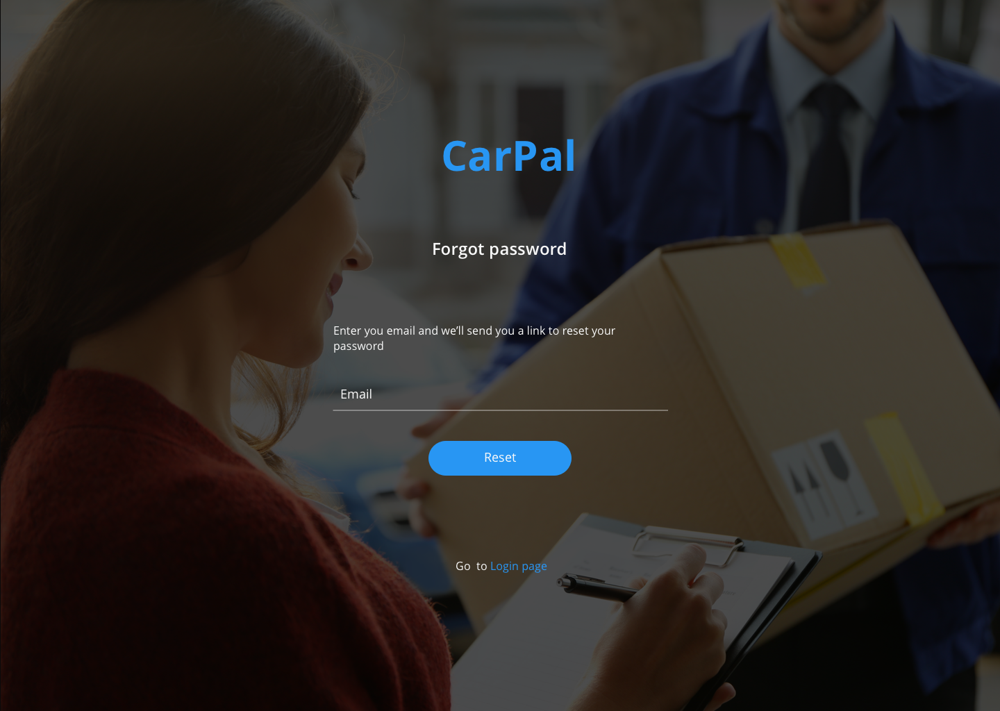

# Test task two
*It was implemented in Jan, 2017. I've made it public here just in case if other front-end developers can find some relevant information for similar tasks. For example, how to structure their test tasks or what kind of tools can be useful while coding.*

First I designed the pages I was required to build.

*Btw, the design implementation is fully responsive. Sometimes you don't have any instructions/mock-ups how to make a design look good for tablet/mobile screen sizes. Just rely on your logic and UX knowledge :)*

